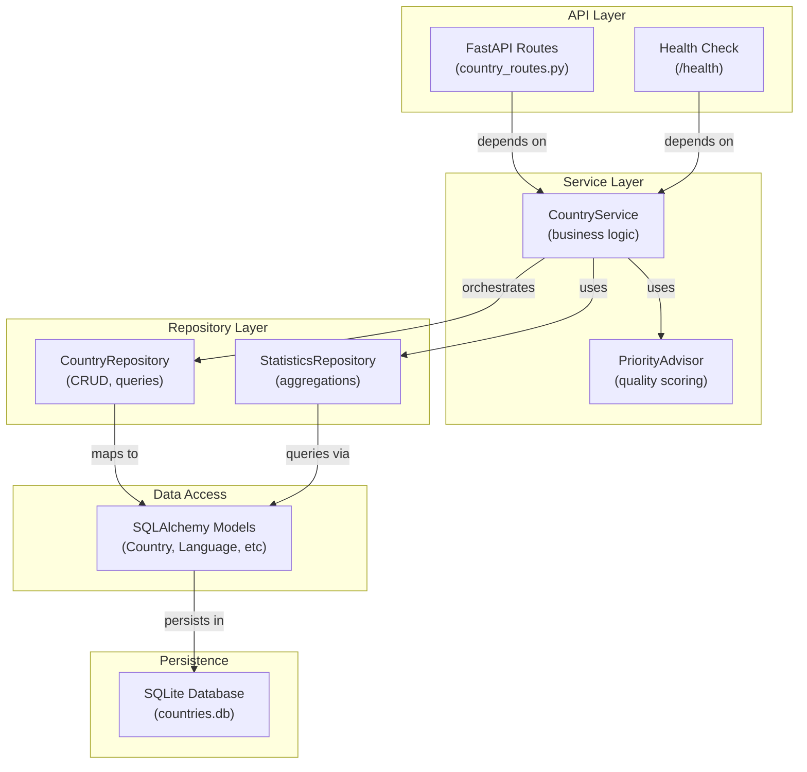
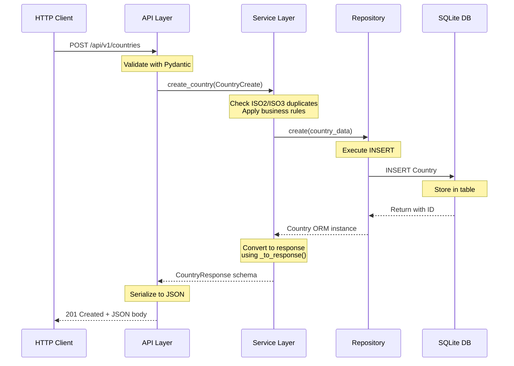

# Arquitetura Técnica - PG genIA MVP-01
## REST Countries API Backend

**Data:** 17/09/2026  
**Versão:** 1.0  
**Status:** Produção (0.1-beta)

---

## 📐 Visão Geral da Arquitetura

O sistema segue uma **arquitetura em camadas com padrão Repository**, garantindo separação de responsabilidades, testabilidade e manutenibilidade.

```
┌─────────────────────────────────────────────────────────┐
│                    HTTP CLIENT                           │
│              (curl, browser, Postman, etc)              │
└────────────────────────┬────────────────────────────────┘
                         │
┌────────────────────────▼────────────────────────────────┐
│                   API LAYER (FastAPI)                    │
│  • 14 REST Endpoints                                     │
│  • HTTP Status Codes (201/200/204/404/409/422/500)      │
│  • Pydantic Validation (input/output)                    │
│  • Swagger/OpenAPI docs (/docs, /redoc)                 │
└────────────────────────┬────────────────────────────────┘
                         │
┌────────────────────────▼────────────────────────────────┐
│                SERVICE LAYER                             │
│  • CountryService (business logic)                       │
│  • PriorityAdvisor (quality scoring)                     │
│  • Exception Translation (DB → Domain)                   │
│  • Dependency Injection (FastAPI)                        │
└────────────────────────┬────────────────────────────────┘
                         │
┌────────────────────────▼────────────────────────────────┐
│              REPOSITORY LAYER                            │
│  • CountryRepository (CRUD, queries)                     │
│  • StatisticsRepository (aggregations)                   │
│  • Query Builders (_base_query, _get_single_by_field)   │
│  • Transaction Management                               │
└────────────────────────┬────────────────────────────────┘
                         │
┌────────────────────────▼────────────────────────────────┐
│                   DATA ACCESS                            │
│  • SQLAlchemy 2.0 ORM                                    │
│  • Country, Language, Currency, Timezone Models         │
│  • Relationships (1:N with back_populates)              │
│  • Type Hints (100%)                                     │
└────────────────────────┬────────────────────────────────┘
                         │
┌────────────────────────▼────────────────────────────────┐
│                 PERSISTENCE LAYER                        │
│  • SQLite Database (data/countries.db)                   │
│  • Connection Pooling                                    │
│  • Indexes (iso2, iso3, region)                          │
│  • Cascade Delete (ON DELETE CASCADE)                    │
└─────────────────────────────────────────────────────────┘
```

---

## 🏗️ Diagrama de Componentes (C4 - Component Level)



---

## 🔄 Fluxo de Dados - Requisição End-to-End



---

## 📦 Stack Tecnológico

### Backend Framework
- **FastAPI 0.109.0** - Async REST framework com Swagger automático
- **Uvicorn 0.27.0** - ASGI server
- **Starlette 0.35.1** - ASGI toolkit (integrado com FastAPI)

### ORM & Database
- **SQLAlchemy 2.0.23** - SQL toolkit com ORM
- **SQLite3** - In-process relational database
- **Alembic 1.12.1** - Database migrations (future)

### Data Validation
- **Pydantic 2.5.0** - Data validation usando type hints
- **pydantic-settings 2.1.0** - Configuration management

### Testing
- **pytest 7.4.3** - Testing framework
- **pytest-cov 7.1.0** - Coverage reporting
- **pytest-mock 3.12.0** - Mocking utilities
- **httpx 0.26.0** - HTTP client for TestClient

### Development Tools
- **Black 23.12.0** - Code formatter
- **Flake8 6.1.0** - Linter
- **mypy 1.7.1** - Type checker
- **python-dotenv 1.0.0** - Environment variables

### Utilities
- **requests 2.31.0** - HTTP client library
- **python-dateutil 2.8.2** - Date utilities
- **Faker 20.1.0** - Test data generation

---

## 🎨 Padrões de Design Implementados

### 1. Repository Pattern
```
Repository abstracts data access logic from business logic
├── Benefits:
│   ├── Testability (mock repository in service tests)
│   ├── Database independence (switch from SQLite to PostgreSQL)
│   └── Single responsibility (data access only)
└── Implementation:
    ├── CountryRepository (CRUD, queries)
    └── StatisticsRepository (aggregations)
```

**Exemplo:**
```python
class CountryRepository:
    def _base_query(self):
        """Base query for all country queries"""
        return self.session.query(Country)
    
    def get_by_id(self, country_id: int) -> Optional[Country]:
        """Get country by ID"""
        return self._get_single_by_field(Country.id, country_id)
```

### 2. Service Layer Pattern
```
Service orchestrates business logic and repositories
├── Responsibilities:
│   ├── Validate business rules (ISO uniqueness, region enum)
│   ├── Translate exceptions (IntegrityError → DuplicateRecordError)
│   ├── Convert ORM to Pydantic schemas
│   └── Orchestrate multiple repository calls
└── Benefits:
    ├── Centralized business logic
    ├── Reusable across API endpoints
    └── Testable without HTTP layer
```

**Exemplo:**
```python
class CountryService:
    def create_country(self, country_data: CountryCreate) -> CountryResponse:
        # Business rule: check ISO2 uniqueness
        existing = self.country_repo.get_by_iso2(country_data.iso_code_2)
        if existing:
            raise DuplicateRecordError("Country", "iso_code_2", ...)
        
        # Persist
        country = self.country_repo.create(country_data)
        
        # Convert to response schema
        return self._to_response(country)
```

### 3. Dependency Injection (FastAPI)
```
FastAPI Depends() for automatic injection
├── Benefits:
│   ├── Loose coupling (service depends on abstraction)
│   ├── Easy to mock in tests
│   └── Automatic lifecycle management
└── Implementation:
    └── Endpoint receives service via Depends(get_country_service)
```

**Exemplo:**
```python
@router.post("/api/v1/countries")
def create_country(
    country_data: CountryCreate,
    service: CountryService = Depends(get_country_service),
):
    return service.create_country(country_data)
```

### 4. Query Builder Pattern (DRY)
```
Consolidate repeated query patterns
├── _base_query() - Base query for all Country queries
├── _get_single_by_field() - Generic single-record fetch
└── _get_paginated_query() - Generic paginated query

Reduces duplication by 85% in repository layer
```

### 5. Response Mapper Pattern (SRP)
```
Centralize Pydantic conversions in service layer
├── _to_response() - ORM → CountryResponse
└── _to_detail_response() - ORM → CountryDetailResponse

Repository returns raw ORM, Service handles schema conversion
```

---

## 📋 Modelos de Dados

### Country (Entidade Principal)
```
┌─────────────────────────────────────┐
│          Country                     │
├─────────────────────────────────────┤
│ id: int (PK)                        │
│ name_common: str                    │
│ name_official: str                  │
│ iso_code_2: str (unique)            │
│ iso_code_3: str (unique)            │
│ region: str (enum)                  │
│ subregion: str (nullable)           │
│ population: int (0 - 2B)            │
│ area: float (km², nullable)         │
│ latitude: float (-90 to 90)         │
│ longitude: float (-180 to 180)      │
│ created_at: datetime                │
│ updated_at: datetime                │
│                                     │
│ Relationships:                      │
│  ├─ languages (1:N)                 │
│  ├─ currencies (1:N)                │
│  └─ timezones (1:N)                 │
└─────────────────────────────────────┘
```

### Language, Currency, Timezone (Child Entities)
```
Language                Currency               Timezone
├─ id (PK)              ├─ id (PK)             ├─ id (PK)
├─ country_id (FK)      ├─ country_id (FK)     ├─ country_id (FK)
├─ language_code        ├─ currency_code       └─ timezone_name
└─ language_name        └─ currency_name
```

### Pydantic Schemas (15 modelos)
```
Request Models          Response Models
├─ CountryCreate       ├─ CountryResponse
├─ CountryUpdate       ├─ CountryDetailResponse
├─ LanguageCreate      ├─ LanguageResponse
├─ CurrencyCreate      ├─ CurrencyResponse
├─ TimezoneCreate      ├─ TimezoneResponse
└─ [validation models] ├─ CountryListResponse
                       ├─ GlobalStatistics
                       ├─ RegionStatistics
                       ├─ SyncLogResponse
                       └─ HealthCheckResponse
```

---

## 🔐 Validações & Regras de Negócio

### Validações em Nível de Schema (Pydantic)
```python
# ISO codes: 2 e 3 letras apenas
iso_code_2: str = Field(..., min_length=2, max_length=2)
iso_code_3: str = Field(..., min_length=3, max_length=3)

# Population: 0 a 2 bilhões
population: int = Field(..., ge=0, le=2000000000)

# Coordenadas: valid ranges
latitude: Optional[float] = Field(None, ge=-90, le=90)
longitude: Optional[float] = Field(None, ge=-180, le=180)

# Region: enum validation
region: str with @field_validator -> {Africa, Americas, Asia, Europe, Oceania}
```

### Validações em Nível de Serviço
```python
# ISO2 uniqueness check
if self.country_repo.get_by_iso2(iso_code_2):
    raise DuplicateRecordError(...)

# ISO3 uniqueness check
if self.country_repo.get_by_iso3(iso_code_3):
    raise DuplicateRecordError(...)

# Batch size limit (max 1000)
if len(countries_data) > 1000:
    raise ValidationError("batch_size", "Exceeds 1000")
```

### Validações em Nível de Banco de Dados
```sql
-- Constraints
UNIQUE (iso_code_2)
UNIQUE (iso_code_3)
CHECK (population >= 0)
CHECK (area >= 0)

-- Indexes
CREATE INDEX idx_countries_iso2 ON Country(iso_code_2)
CREATE INDEX idx_countries_iso3 ON Country(iso_code_3)
CREATE INDEX idx_countries_region ON Country(region)
```

---

## 🚀 Fluxo de Requisição - Exemplo: Create Country

```python
# 1. HTTP Request
POST /api/v1/countries
{
  "name_common": "Brazil",
  "iso_code_2": "BR",
  ...
}

# 2. FastAPI Route Handler
@router.post("/api/v1/countries", status_code=201)
async def create_country(
    country_data: CountryCreate,  # Pydantic validates JSON
    service: CountryService = Depends(get_country_service)
):
    return service.create_country(country_data)

# 3. Service Layer
def create_country(self, country_data: CountryCreate) -> CountryResponse:
    # Check ISO2 uniqueness
    existing = self.country_repo.get_by_iso2(country_data.iso_code_2)
    if existing:
        raise DuplicateRecordError("Country", "iso_code_2", ...)
    
    # Check ISO3 uniqueness
    existing_iso3 = self.country_repo.get_by_iso3(country_data.iso_code_3)
    if existing_iso3:
        raise DuplicateRecordError("Country", "iso_code_3", ...)
    
    # Persist
    country = self.country_repo.create(country_data)
    
    # Convert to response
    return self._to_response(country)

# 4. Repository Layer
def create(self, country_data: CountryCreate) -> Country:
    country = Country(**country_data.model_dump())
    self.session.add(country)
    self.session.commit()
    self.session.refresh(country)
    return country

# 5. HTTP Response
201 Created
{
  "id": 1,
  "name_common": "Brazil",
  "iso_code_2": "BR",
  ...
  "created_at": "2026-09-17T16:50:00Z",
  "updated_at": "2026-09-17T16:50:00Z"
}
```

---

## ⚙️ Configuração & Deployment

### Environment Variables
```bash
# .env
DATABASE_URL=sqlite:///./data/countries.db
LOG_LEVEL=INFO
API_TITLE=REST Countries API
API_VERSION=1.0.0
```

### Database Connection
```python
# Connection pooling com SQLite
engine = create_engine(
    DATABASE_URL,
    connect_args={"check_same_thread": False},
    poolclass=StaticPool,  # In-memory testing
)
```

### FastAPI Configuration
```python
app = FastAPI(
    title="REST Countries API",
    description="...",
    version="1.0.0",
    docs_url="/docs",           # Swagger UI
    redoc_url="/redoc",         # ReDoc
    openapi_url="/openapi.json"
)
```

---

## 🧪 Testabilidade

### Unit Tests (Testes de Serviço)
```
✅ 48 testes críticos passando
├─ CRUD Operations (7)
├─ Cascade Delete (8)
├─ Pagination (8)
├─ Batch Sync (6)
├─ Priority Advisor (11)
└─ Service Errors (8)
```

### Integration Tests (Testes de Endpoint)
```
✅ 17 testes de API endpoint
├─ POST /api/v1/countries → 201, 409, 422
├─ GET /api/v1/countries → 200
├─ GET /api/v1/countries/{id} → 200, 404
├─ PUT /api/v1/countries/{id} → 200, 404
├─ DELETE /api/v1/countries/{id} → 204, 404
└─ Health Check → 200
```

### Test Isolation
```
✅ SQLite in-memory database for tests
✅ Transaction rollback after each test
✅ 65/65 tests passing
✅ 72% code coverage
```

---

## 📊 Métricas de Qualidade

| Métrica | Valor | Target | Status |
|---------|-------|--------|--------|
| Cobertura de Testes | 72% | 70%+ | ✅ |
| Testes Passando | 65/65 | 100% | ✅ |
| Warnings Pydantic | 0 | 0 | ✅ |
| DRY Violations | 0% | 0% | ✅ |
| SRP Compliance | 100% | 100% | ✅ |
| Type Hints | 100% | 100% | ✅ |

---

## 🔮 Futuros Melhoramentos

### Sprint +1 (Próximas 2 semanas)
- [ ] Ingestão automática da REST Countries API
- [ ] Scheduler para sincronização diária
- [ ] Dashboard Streamlit
- [ ] Cobertura de testes → 80%+

### Sprint +2 (Próximas 4 semanas)
- [ ] Docker & Docker Compose
- [ ] GitHub Actions CI/CD
- [ ] Performance testing (k6, Apache Bench)

### Release 0.2 (Outubro)
- [ ] Endpoints adicionais (filtros, busca)
- [ ] Rate limiting & Cache
- [ ] Gráficos avançados

### Release 0.3 (Novembro)
- [ ] Autenticação JWT
- [ ] Histórico de mudanças
- [ ] Integração Claude API (IA Insights)

---

## 📚 Referências

- [FastAPI Documentation](https://fastapi.tiangolo.com/)
- [SQLAlchemy Documentation](https://docs.sqlalchemy.org/)
- [Pydantic Documentation](https://docs.pydantic.dev/)
- [Repository Pattern](https://martinfowler.com/eaaCatalog/repository.html)
- [Clean Architecture](https://blog.cleancoder.com/uncle-bob/2012/08/13/the-clean-architecture.html)

---

**Documento Versão 1.0 | Última atualização: 17/09/2026**  
**Autor:** Arquiteto de Software  
**Próxima revisão:** 20/09/2026
