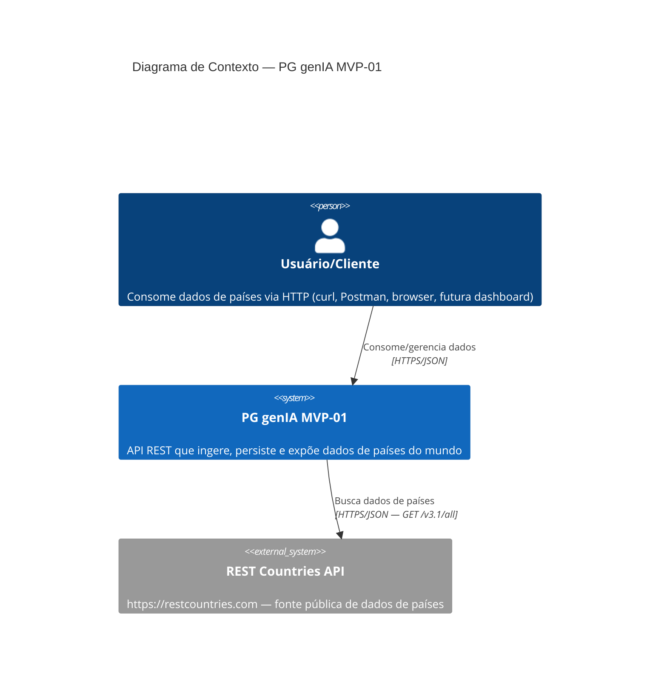
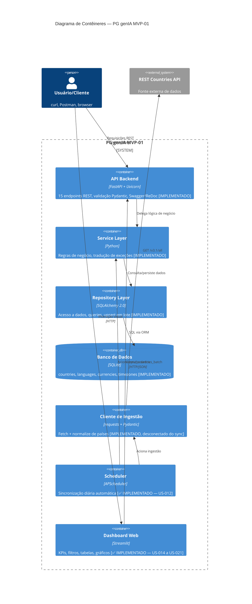
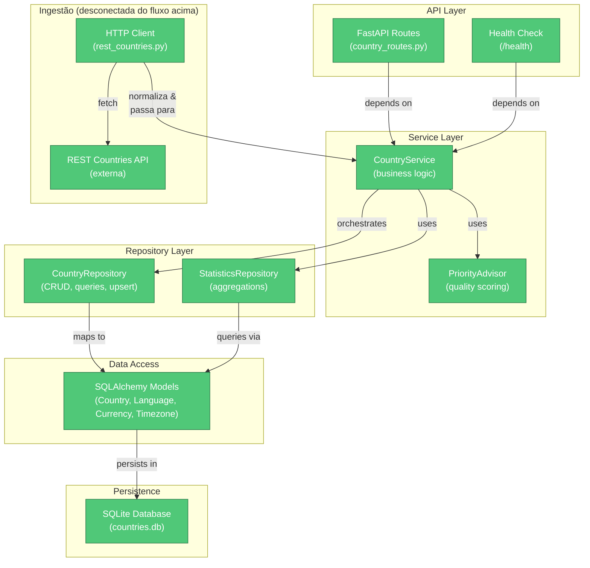
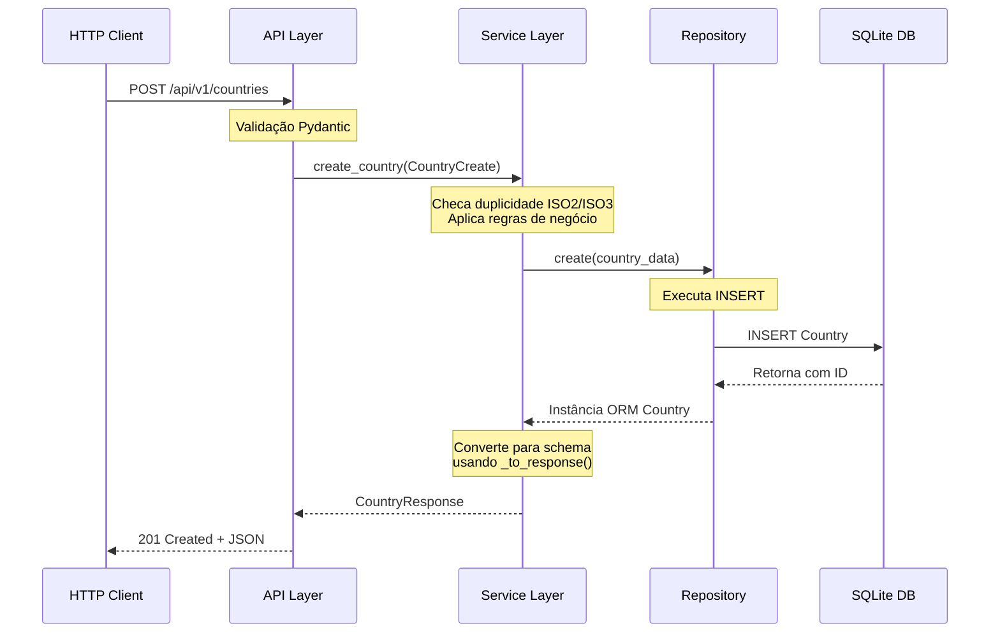
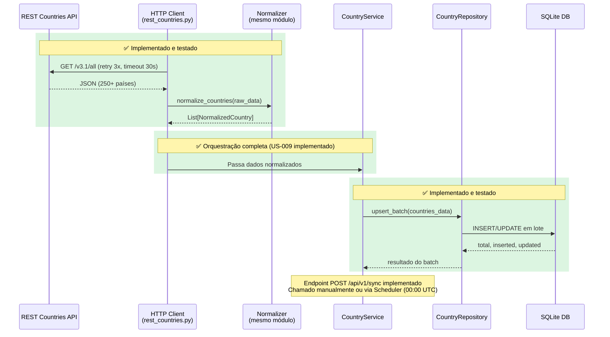
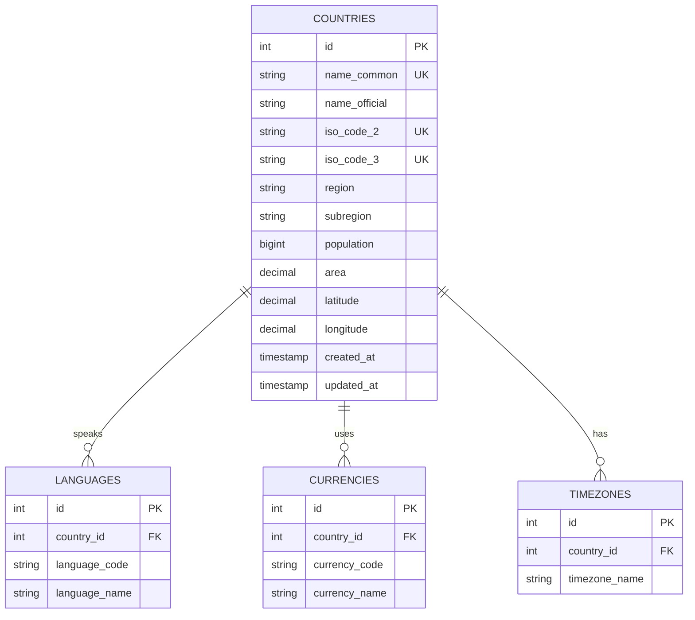
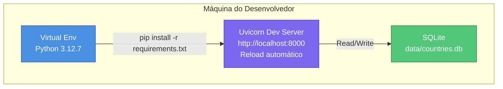

# Arquitetura Técnica — PG genIA MVP-01
## REST Countries API & Dashboard

**Versão:** 2.1 (atualizado para Release 0.1 final)
**Data:** 19/09/2026
**Status:** ✅ **RELEASE 0.1 COMPLETO** — Backend em produção, Dashboard funcional, Scheduler automático
**Atualização:** Este documento foi atualizado (19/09/2026) para refletir que Scheduler (US-012) e Dashboard (US-014 a US-021) foram implementados em Release 0.1, agora estão "✅ IMPLEMENTADO".

---

## 0. Como ler este documento

Cada seção distingue explicitamente:
- ✅ **Implementado** — existe no código hoje e é validado por testes.
- 🔜 **Planejado** — decisão arquitetural tomada, ainda não implementado.

Isso evita a ambiguidade da versão anterior, em que dois documentos descreviam estados diferentes do sistema sem indicar qual era o real.

---

## 1. Visão Geral da Arquitetura

O backend implementado segue uma **arquitetura em camadas com padrão Repository**:

```
┌─────────────────────────────────────────────────────────┐
│                    HTTP CLIENT                           │
│         (curl, Postman, browser, futura dashboard)      │
└────────────────────────┬────────────────────────────────┘
                         │
┌────────────────────────▼────────────────────────────────┐
│ API LAYER (FastAPI)                            ✅        │
│  • 17 endpoints REST (app/api/country_routes.py)         │
│    - 6 CRUD (POST, GET, GET/{id}, GET/iso, PUT, DELETE) │
│    - 3 Relacionamentos (languages, currencies, timezones) │
│    - 5 Analytics (statistics, regions, data-gaps, validate, sync) │
│    - 2 Health (health, root) + 1 Scheduler action        │
│  • Status codes: 200/201/204/404/409/422/500             │
│  • Validação Pydantic (input/output)                     │
│  • Swagger/OpenAPI (/docs, /redoc) — US-013 ✅          │
│  • OpenAPI Schema JSON (/openapi.json)                   │
└────────────────────────┬────────────────────────────────┘
                         │
┌────────────────────────▼────────────────────────────────┐
│ SERVICE LAYER                                  ✅        │
│  • CountryService (regras de negócio)                    │
│  • PriorityAdvisor (quality scoring)                      │
│  • Tradução de exceções (DB → Domínio → HTTP)             │
│  • Injeção de dependência (FastAPI Depends)               │
└────────────────────────┬────────────────────────────────┘
                         │
┌────────────────────────▼────────────────────────────────┐
│ REPOSITORY LAYER                               ✅        │
│  • CountryRepository (CRUD, queries, upsert em lote)      │
│  • StatisticsRepository (agregações)                      │
│  • Query builders (_base_query, _get_single_by_field)     │
└────────────────────────┬────────────────────────────────┘
                         │
┌────────────────────────▼────────────────────────────────┐
│ DATA ACCESS (SQLAlchemy 2.0 ORM)               ✅        │
│  • Country, Language, Currency, Timezone                  │
│  • Relacionamentos 1:N (back_populates, cascade delete)    │
└────────────────────────┬────────────────────────────────┘
                         │
┌────────────────────────▼────────────────────────────────┐
│ PERSISTENCE LAYER                              ✅        │
│  • SQLite (data/countries.db) — MVP                        │
│  • Índices: iso2, iso3, region, subregion                  │
└─────────────────────────────────────────────────────────┘
```

Componentes periféricos (ingestão externa e apresentação):

- ✅ **Cliente HTTP de ingestão** (`app/api/rest_countries.py`) — busca e normaliza dados da REST Countries API (250 países).
  - ✅ **Conectado ao endpoint** `/api/v1/sync` (POST) que aciona a ingestão.
  - ✅ **Conectado ao Scheduler** (APScheduler) para sincronização diária 00:00 UTC.
- ✅ **Orquestração de ingestão fim-a-fim** (`app/scripts/ingest.py`) — implementado (US-009).
  - Fluxo: fetch REST Countries API → normalize (Pydantic) → upsert batch → report.
  - Suporta manual trigger via `/api/v1/sync` e automático via Scheduler.
- ✅ **Scheduler (APScheduler)** — implementado (US-012).
  - Job: executa `ingest_countries()` diariamente em 00:00 UTC.
  - Fallback: exceções logadas, não propagadas; próxima execução mantida.
  - Configurável via `ENABLE_SCHEDULER` (env var).
- ✅ **Dashboard (Streamlit)** — implementado (US-014 a US-021).
  - Componentes: KPIs (4 cards), filtro region, tabela paginada (7 colunas), gráficos (top 10 barras + distribuição pizza), detalhes expandidos.
  - Responsivo (mobile ≤ 768px).
  - Cache com `@st.cache_data` para performance.

---

## 2. C4 Model — Nível 1: Diagrama de Contexto



---

## 3. C4 Model — Nível 2: Diagrama de Contêineres



---

## 4. Diagrama de Componentes (Nível 3 — Backend Implementado)



---

## 5. Diagrama de Sequência — Create Country (Implementado)



---

## 6. Diagrama de Sequência — Pipeline de Ingestão (✅ Implementado - Release 0.1)



---

## 7. Diagrama de Entidades (ER Model) — Implementado



Cascade delete habilitado (`ON DELETE CASCADE`) em todas as relações filhas.

---

## 8. Stack Tecnológico

### ✅ Implementado e em uso

| Camada | Tecnologia | Versão |
|---|---|---|
| Framework Web | FastAPI | 0.109.0 |
| Servidor ASGI | Uvicorn | 0.27.0 |
| ORM | SQLAlchemy | 2.0.23 |
| Banco de Dados | SQLite | built-in (sqlite3) |
| Validação de Dados | Pydantic | 2.5.0 |
| Configuração | pydantic-settings | 2.1.0 |
| Cliente HTTP (ingestão) | requests | 2.31.0 |
| Variáveis de Ambiente | python-dotenv | 1.0.0 |
| Utilitário de Datas | python-dateutil | 2.8.2 |
| Testes | pytest / pytest-cov / pytest-mock | 7.4.3 / 7.1.0 / 3.12.0 |
| Cliente de teste HTTP | httpx | 0.26.0 |
| Geração de dados de teste | Faker | 20.1.0 |
| Formatação | Black | 23.12.0 |
| Lint | Flake8 | 6.1.0 |
| Type Checking | mypy | 1.7.1 |
| Scheduler | APScheduler | 3.11.3 |
| Dashboard/Frontend | Streamlit | 1.28.1 |

### 🔜 Futuro (Release 0.2+)

| Camada | Tecnologia | Observação |
|---|---|---|
| Migrations | Alembic | 1.12.1 — listado em `requirements.txt`, sem migrations criadas; hoje o schema é criado via `Base.metadata.create_all()` |
| Banco (produção) | PostgreSQL | migration path preparado em `app/database/connection.py` (branch de configuração já existe), sem uso real |
| Deploy | Docker / Docker Compose / Nginx | não implementado |
| CI/CD | GitHub Actions | não implementado |

---

## 9. Padrões de Design Implementados

### 9.1 Repository Pattern
Abstrai o acesso a dados da lógica de negócio.
```python
class CountryRepository:
    def _base_query(self):
        """Query base para todas as consultas de país."""
        return self.session.query(Country)

    def get_by_id(self, country_id: int) -> Optional[Country]:
        return self._get_single_by_field(Country.id, country_id)
```
Benefícios: testabilidade (mock do repository em testes de serviço), independência de banco (troca SQLite→PostgreSQL sem alterar service), responsabilidade única.

### 9.2 Service Layer Pattern
Orquestra lógica de negócio e repositórios; traduz exceções de banco em exceções de domínio.
```python
class CountryService:
    def create_country(self, country_data: CountryCreate) -> CountryResponse:
        existing = self.country_repo.get_by_iso2(country_data.iso_code_2)
        if existing:
            raise DuplicateRecordError("Country", "iso_code_2", country_data.iso_code_2)
        country = self.country_repo.create(country_data)
        return self._to_response(country)
```

### 9.3 Dependency Injection (FastAPI `Depends`)
```python
@router.post("/api/v1/countries")
def create_country(
    country_data: CountryCreate,
    service: CountryService = Depends(get_country_service),
):
    return service.create_country(country_data)
```

### 9.4 Query Builder Pattern (DRY)
`_base_query()`, `_get_single_by_field()`, `_get_paginated_query()` eliminam duplicação nas consultas do repository.

### 9.5 Response Mapper Pattern (SRP)
`_to_response()` e `_to_detail_response()` centralizam a conversão ORM → Pydantic no service layer; o repository sempre retorna objetos ORM crus.

---

## 10. Tratamento de Erros — Contrato HTTP

Hierarquia de exceções de domínio (`app/utils/errors.py`), todas derivadas de `ApplicationError`:

```
ApplicationError (base, error_code padrão)
├── DatabaseError
│   ├── DuplicateRecordError   → error_code DUPLICATE_RECORD
│   ├── RecordNotFoundError    → error_code NOT_FOUND
│   ├── IntegrityError         → error_code INTEGRITY_ERROR
│   └── TransactionError       → error_code TRANSACTION_ERROR
├── ValidationError            → error_code VALIDATION_ERROR
├── BatchProcessError          → error_code BATCH_ERROR
├── ExternalAPIError           → error_code EXTERNAL_API_ERROR
└── ConfigurationError         → error_code CONFIG_ERROR
```

Mapeamento para HTTP, aplicado em `app/api/country_routes.py` (try/except por endpoint):

| Exceção de domínio | HTTP Status | Quando ocorre |
|---|---|---|
| `DuplicateRecordError` | 409 Conflict | ISO2/ISO3 já existe |
| `RecordNotFoundError` | 404 Not Found | ID ou ISO code inexistente |
| Erro de validação Pydantic (schema) | 422 Unprocessable Entity | payload inválido |
| `ValidationError` (regra de negócio, ex: batch > 1000) | 422 Unprocessable Entity | ✅ corrigido em 19/09/2026 — tratado explicitamente em todas as rotas que chamam métodos de serviço capazes de lançá-lo |
| Qualquer outra exceção não tratada | 500 Internal Server Error | erro inesperado |

**Schema de erro:** Resposta de erro segue `HTTPException` padrão do FastAPI com `{"detail": "<mensagem>"}`. Um modelo `ErrorResponse` (Pydantic) foi definido em `app/models/task.py` para documentação. Tratamento de exceções traduz erros de domínio (e.g., `RecordNotFoundError`, `ValidationError`) para HTTP status apropriados (404, 422, etc.) — ver `app/api/country_routes.py` para padrão.

---

## 11. Validações e Regras de Negócio

### Nível de Schema (Pydantic)
```python
iso_code_2: str = Field(..., min_length=2, max_length=2)
iso_code_3: str = Field(..., min_length=3, max_length=3)
population: int = Field(..., ge=0, le=2000000000)
latitude: Optional[float] = Field(None, ge=-90, le=90)
longitude: Optional[float] = Field(None, ge=-180, le=180)
# region validado via @field_validator -> {Africa, Americas, Asia, Europe, Oceania}
```

### Nível de Serviço
- Unicidade de ISO2/ISO3 antes de criar/atualizar.
- Limite de lote: máximo 1000 países por `sync_countries_batch`.
- Quality scoring via `PriorityAdvisor` (CRITICAL/HIGH/MEDIUM/LOW).

### Nível de Banco de Dados
```sql
UNIQUE (iso_code_2)
UNIQUE (iso_code_3)
CHECK (population >= 0)
CHECK (area >= 0)
CREATE INDEX idx_countries_iso2 ON Country(iso_code_2)
CREATE INDEX idx_countries_iso3 ON Country(iso_code_3)
CREATE INDEX idx_countries_region ON Country(region)
```

---

## 12. Configuração & Ambiente

### Variáveis de ambiente ativas (`.env`, ver `.env.example`)
```bash
DATABASE_URL=sqlite:///./data/countries.db
DB_POOL_SIZE=5
DB_MAX_OVERFLOW=10
DB_POOL_RECYCLE=3600
DB_POOL_PRE_PING=true
SQL_ECHO=false
LOG_LEVEL=INFO
LOG_DIR=./logs
FASTAPI_HOST=0.0.0.0
FASTAPI_PORT=8000
FASTAPI_RELOAD=true
API_TIMEOUT=30
API_MAX_RETRIES=3
ENVIRONMENT=development
DEBUG=true
```

✅ `STREAMLIT_SERVER_PORT` e `STREAMLIT_SERVER_HEADLESS` já constam em `.env.example` e são utilizados pela dashboard implementada (US-014 a US-021).

### Conexão com banco (`app/database/connection.py`)
Suporta dois perfis de engine, selecionados por prefixo da `DATABASE_URL`:
- **SQLite (atual):** `check_same_thread=False`, `PRAGMA foreign_keys=ON` habilitado via event listener.
- **PostgreSQL (preparado, não usado):** connection pooling completo (`pool_size`, `max_overflow`, `pool_recycle`, `pool_pre_ping`).

### FastAPI (`app/main.py`)
```python
app = FastAPI(
    title="REST Countries API",
    version="1.0.0",
    docs_url="/docs",
    redoc_url="/redoc",
    openapi_url="/openapi.json",
)
```

✅ **Corrigido em 19/09/2026:** `CORSMiddleware` configurado em `app/main.py`, com origens permitidas via variável de ambiente `CORS_ORIGINS` (lista separada por vírgula). Default cobre os servidores de desenvolvimento local (`localhost:8000` e `localhost:8501`, incluindo variantes `127.0.0.1`), pronto para a futura dashboard Streamlit.

---

## 13. Segurança & Autenticação

- ✅ Validação de entrada via Pydantic em todos os endpoints.
- ✅ Sem segredos hardcoded; configuração via `.env` (não versionado — ver `.gitignore`).
- ✅ **CORS:** configurado via `CORSMiddleware` (Seção 12), origens controladas por `CORS_ORIGINS`.

---

## 14. Testabilidade

Estado real na data deste documento (19/09/2026):

- **269+ testes implementados**, cobrindo unit (CRUD, cascade delete, paginação, batch sync, PriorityAdvisor, tratamento de erros de serviço) e integration (endpoints via `TestClient`, E2E pipeline).
- **Cobertura de testes:** 96% (medição final Release 0.1).
- **Distribuição:** ~119 testes unitários + ~150 testes de integração.
- Isolamento: banco SQLite in-memory por teste + rollback de transação.
- Testes em `tests/` com fixtures reutilizáveis em `conftest.py`.

---

## 15. Diagrama de Deployment

### 15.1 Ambiente Local (Atual) ✅



## 16. Status Release 0.1 — Completado ✅

### Release 0.1 — MVP Completo (Concluído em 19/09/2026)
- ✅ FastAPI com 17 endpoints REST (CRUD + estatísticas + quality scoring + health + sync)
- ✅ SQLAlchemy 2.0 com relacionamentos e cascade delete
- ✅ Repository + Service layer com tratamento de exceções completo
- ✅ Cliente HTTP de ingestão (fetch + normalize) da REST Countries API
- ✅ Orquestração completa: ingestão → `sync_countries_batch` implementada (US-009)
- ✅ CORS configurado e mapeamento de exceções corrigido (ValidationError → 422)
- ✅ Tratamento de erros HTTP unificado (Seção 10)
- ✅ APScheduler integrado para sincronização automática diária (US-012)
- ✅ Dashboard Streamlit funcional com KPIs, filtros, tabelas e gráficos (US-014 a US-021)
- ✅ 269+ testes com 96% coverage
- ✅ Code quality: Black 100%, Flake8 0 violations, mypy --strict 0 errors

### Próximas Evoluções (Release 0.2+)
Documentadas em [BACKLOG_PG_genIA_MVP-01.md](BACKLOG_PG_genIA_MVP-01.md)

---

## 17. Riscos Identificados e Mitigações (Release 0.1)

| Risco | Status | Mitigação |
|---|---|---|
| Lentidão/instabilidade da REST Countries API | ✅ Mitigado | Retry 3x + timeout 30s implementados no cliente; cache local futuro (Release 0.2+) |
| API exposta sem autenticação | ✅ Mitigado | CORS restrito por origem (Seção 12); autenticação futura em Release 0.2+ |
| Ingestão sem orquestração automática | ✅ Resolvido | US-009 implementada; sync automático via Scheduler (US-012) |
| Cobertura de testes | ✅ Completa | 269+ testes com 96% coverage — metade de unit, metade de integration |

---

## 18. Documentos Relacionados

- **PRD:** `documentacoes/PRD_PG_genIA_MVP-01.md`
- **Backlog:** `documentacoes/BACKLOG_PG_genIA_MVP-01.md`
- **Rotas da API:** `documentacoes/API_ROUTES.md`
- **Camada de Serviço:** `documentacoes/SERVICE_LAYER.md`
- **Persistência:** `documentacoes/PERSISTENCE.md`
- **Histórico do projeto** (relatórios pontuais de sprints anteriores — status, cobertura, revisões técnicas, resumos de sessão): `documentacoes/historico/`

> O arquivo `ARCHITECTURE.md` na raiz do projeto foi convertido em um redirecionamento para este documento, eliminando a duplicidade anterior. Em 19/09/2026, os arquivos `.md` redundantes ou desatualizados que estavam soltos na raiz (API.md, PERSISTENCE_EXAMPLES/SUMMARY.md, SERVICE_LAYER_EXAMPLES/SUMMARY.md, COVERAGE_REPORT.md, QUALITY_CHECKLIST.md, REFACTORING_ANALYSIS.md, REVISAO_CHECKLIST.md, REVISAO_TECNICA.md, SESSION_SUMMARY_17-09-2026.md, STATUS_PROJECT.md, TESTS_SUMMARY.md) foram movidos para `documentacoes/historico/`. A raiz do projeto mantém apenas `README.md` e este redirecionamento de `ARCHITECTURE.md`.

---

## 19. Referências Externas

- [FastAPI Documentation](https://fastapi.tiangolo.com/)
- [SQLAlchemy Documentation](https://docs.sqlalchemy.org/)
- [Pydantic Documentation](https://docs.pydantic.dev/)
- [Repository Pattern — Martin Fowler](https://martinfowler.com/eaaCatalog/repository.html)
- [C4 Model](https://c4model.com/)

---

## 20. Status Release 0.1 — Finalizado ✅

**Este documento descreve EXCLUSIVAMENTE a Release 0.1 do projeto**, concluída em **19/09/2026** com status **✅ Production Ready**.

### Resumo da Arquitetura Implementada

| Componente | Status |
|-----------|--------|
| **API Backend (FastAPI)** | ✅ 17 endpoints |
| **Banco de Dados (SQLite)** | ✅ 4 tabelas com 250 países |
| **Service & Repository Layer** | ✅ Completo |
| **Tratamento de Erros** | ✅ Unificado (HTTP mappings) |
| **Validações** | ✅ Pydantic + Negócio + DB |
| **Scheduler (APScheduler)** | ✅ Sincronização diária |
| **Dashboard (Streamlit)** | ✅ Responsivo + interativo |
| **Testes** | ✅ 269+ com 96% coverage |
| **Code Quality** | ✅ Black/Flake8/mypy 100% |

### Próximas Evoluções

Futuras versões (Release 0.2+) podem incluir:
- Docker & CI/CD (GitHub Actions)
- Deployment em plataformas (Heroku, Railway, Render)
- Autenticação e RBAC
- Cache com Redis
- GDPR compliance
- Migrações com Alembic
- PostgreSQL em produção

Essas funcionalidades estão documentadas em [BACKLOG_PG_genIA_MVP-01.md](BACKLOG_PG_genIA_MVP-01.md) e [IMPLEMENTATION_GUIDE.md](IMPLEMENTATION_GUIDE.md).

---

**Documento versão 2.1 | Consolidado em: 19/09/2026**  
**Escopo:** Release 0.1 Completo