# Arquitetura Técnica
## PG genIA MVP-01: REST Countries Dashboard

**Versão:** 1.0  
**Data:** 15 de Setembro de 2026  
**Arquiteto:** Arquiteto de Software Sênior  
**Status:** Proposta Técnica  

---

## 1. VISÃO GERAL DA ARQUITETURA

### 1.1 Padrão Arquitetural

A solução segue um padrão **Client-Server com camadas** otimizado para MVP:

```
┌─────────────────────────────────────────────────────────┐
│                   CAMADA DE APRESENTAÇÃO                │
│  ┌─────────────────────────────────────────────────┐   │
│  │ Frontend: Streamlit Dashboard (Browser)         │   │
│  │ - Visualização interativa                       │   │
│  │ - KPIs, Filtros, Tabelas, Gráficos             │   │
│  └─────────────────────────────────────────────────┘   │
└─────────────────────────────────────────────────────────┘
                        ↓ HTTP/REST
┌─────────────────────────────────────────────────────────┐
│                   CAMADA DE NEGÓCIO                      │
│  ┌─────────────────────────────────────────────────┐   │
│  │ Backend: FastAPI Server (Uvicorn)              │   │
│  │ - Health Check (/health)                       │   │
│  │ - Data Ingestion Orchestrator                  │   │
│  │ - Scheduled Sync (APScheduler)                 │   │
│  │ - API Endpoints (v0.2+)                        │   │
│  └─────────────────────────────────────────────────┘   │
└─────────────────────────────────────────────────────────┘
                        ↓ SQL
┌─────────────────────────────────────────────────────────┐
│                   CAMADA DE DADOS                        │
│  ┌──────────────────────────┐                           │
│  │ ORM: SQLAlchemy 2.0      │                           │
│  │ - Modelos de dados       │                           │
│  │ - Relacionamentos        │                           │
│  │ - Migrations (Alembic)   │                           │
│  └──────────────────────────┘                           │
│            ↓                                             │
│  ┌──────────────────────────┐                           │
│  │ Database: SQLite         │                           │
│  │ - countries              │                           │
│  │ - languages              │                           │
│  │ - currencies             │                           │
│  │ - timezones              │                           │
│  └──────────────────────────┘                           │
└─────────────────────────────────────────────────────────┘
                        ↓ HTTP
┌─────────────────────────────────────────────────────────┐
│              INTEGRAÇÕES EXTERNAS                        │
│  ┌──────────────────────────┐                           │
│  │ REST Countries API       │                           │
│  │ https://restcountries.com│                           │
│  └──────────────────────────┘                           │
└─────────────────────────────────────────────────────────┘
```

### 1.2 Decisões Arquiteturais Principais

| Decisão | Escolha | Justificativa |
|---------|---------|---------------|
| **Framework Web** | FastAPI | Performance (2x+ rápido que Django), async-native, OpenAPI automático |
| **ORM** | SQLAlchemy 2.0 | Type hints, relacionamentos, migrations com Alembic |
| **Banco de Dados** | SQLite | MVP rápido, sem infra, migration path para PostgreSQL |
| **Frontend** | Streamlit | Prototipagem rápida, sem HTML/CSS, Python-first |
| **Web Server** | Uvicorn | ASGI, performance, integração FastAPI nativa |
| **Scheduler** | APScheduler | Python-native, suporta agendamento complexo |
| **Deployment** | Docker + Docker Compose | Reprodutibilidade, separação de ambientes |

---

## 2. DIAGRAMA DE COMPONENTES

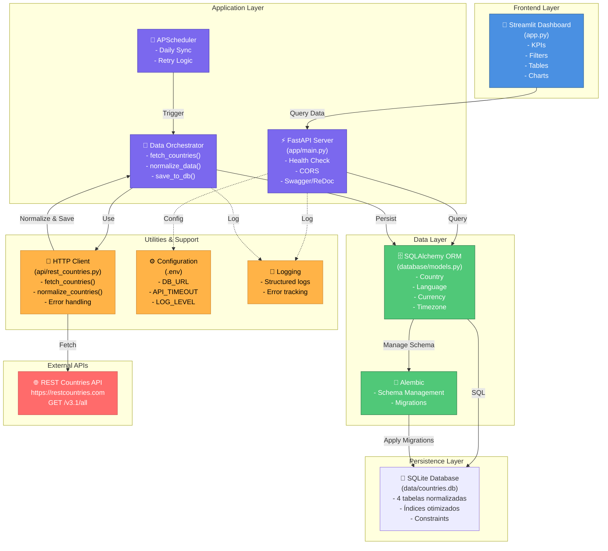

---

## 3. DIAGRAMA DE FLUXO DE DADOS

### 3.1 Ingestão de Dados (ETL Pipeline)

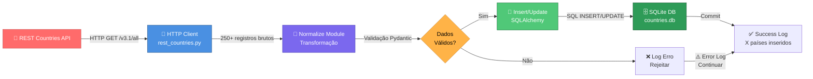

### 3.2 Scheduler de Sincronização

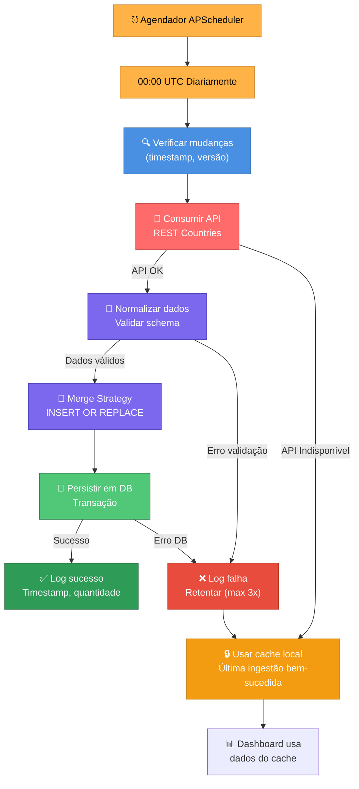

### 3.3 Fluxo de Requisição do Dashboard

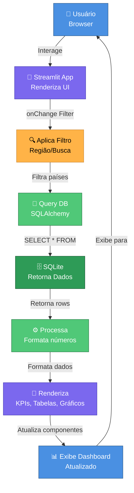

---

## 4. DIAGRAMA DE SEQUÊNCIA - Ingestão Completa

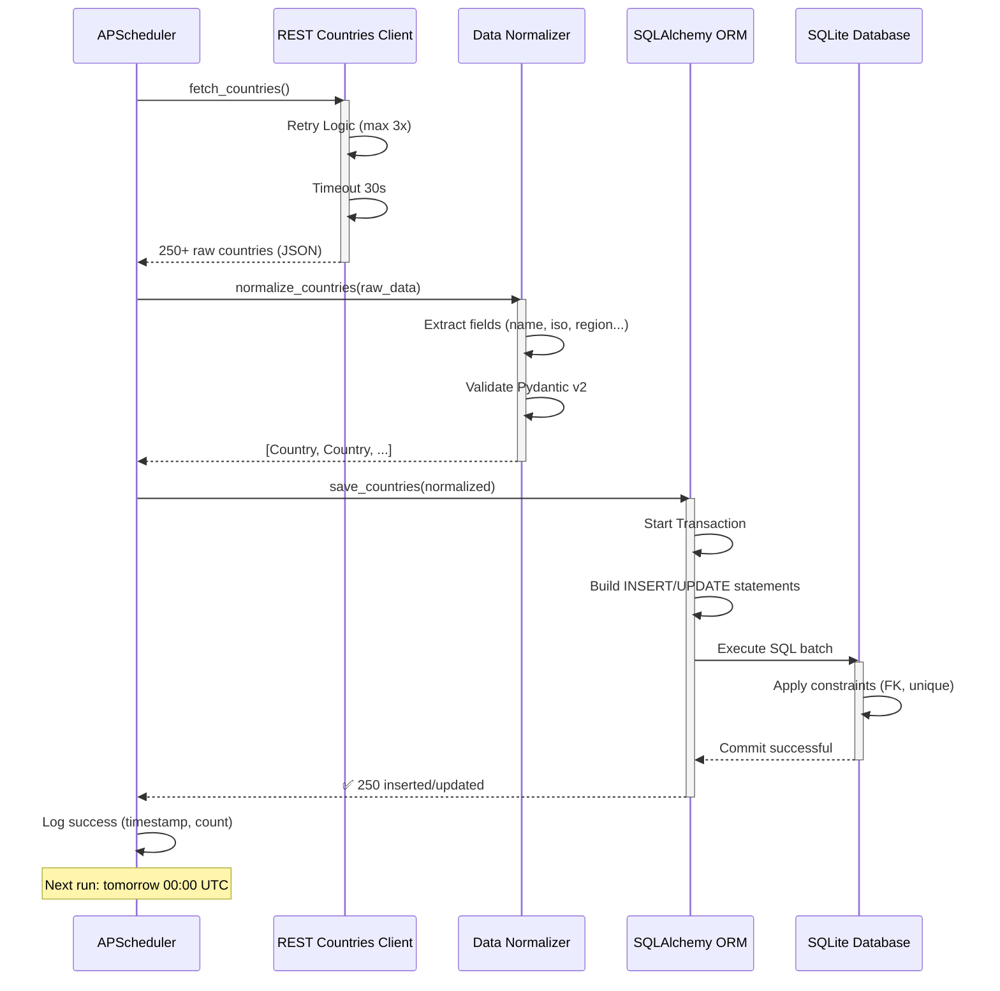

---

## 5. DIAGRAMA DE SEQUÊNCIA - Dashboard Query

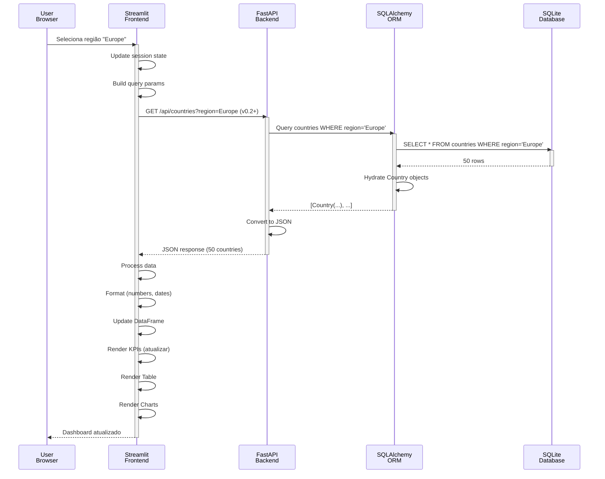

---

## 6. DIAGRAMA DE DEPLOYMENT

### 6.1 Ambiente Local (Desenvolvimento)

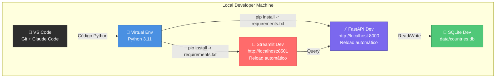

### 6.2 Ambiente Staging/Produção (Docker Compose)

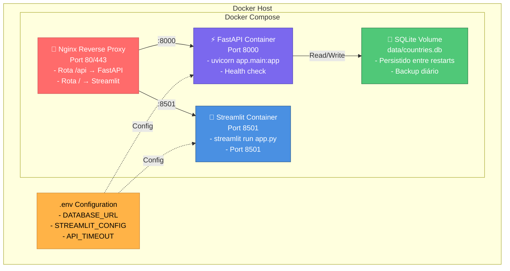

### 6.3 CI/CD Pipeline (GitHub Actions)

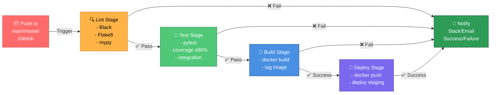

---

## 7. DIAGRAMA DE ENTIDADES (ER Model)

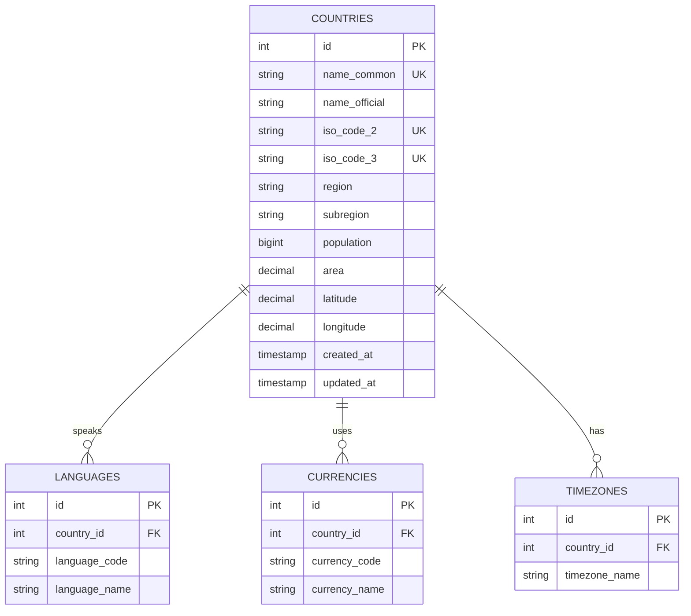

---

## 8. DECISÕES TÉCNICAS PRINCIPAIS

### 8.1 Por que FastAPI?

```
┌──────────────────────────────────────────────────────┐
│ FastAPI vs Alternativas (Release 0.1)               │
├──────────────────┬─────────┬─────────┬──────────────┤
│ Critério         │ FastAPI │ Django  │ Flask        │
├──────────────────┼─────────┼─────────┼──────────────┤
│ Startup Time     │ ⚡⚡⚡   │ ⚡      │ ⚡⚡⚡       │
│ Performance      │ ⚡⚡⚡   │ ⚡      │ ⚡⚡         │
│ Type Hints       │ ⚡⚡⚡   │ ⚡      │ ❌           │
│ OpenAPI Auto     │ ⚡⚡⚡   │ ⚡      │ ❌           │
│ Async Native     │ ⚡⚡⚡   │ ⚡      │ ⚡⚡         │
│ Learning Curve   │ ⚡⚡     │ ⚡      │ ⚡⚡⚡       │
│ Ecosystem        │ ⚡⚡     │ ⚡⚡⚡   │ ⚡⚡⚡       │
└──────────────────┴─────────┴─────────┴──────────────┘

✅ VENCEDOR: FastAPI (performance + DX)
```

### 8.2 Por que SQLite em MVP?

```
┌──────────────────────────────────────────────────────┐
│ SQLite vs Alternativas (Release 0.1)                │
├──────────────────┬──────────┬──────────┬────────────┤
│ Critério         │ SQLite   │ Postgres │ MySQL      │
├──────────────────┼──────────┼──────────┼────────────┤
│ Setup Tempo      │ ⚡⚡⚡    │ ⚡       │ ⚡         │
│ Dependências     │ ⚡⚡⚡    │ ⚡       │ ⚡         │
│ Custo (Dev)      │ ⚡⚡⚡    │ ⚡       │ ⚡         │
│ Escalabilidade   │ ⚡ (MVP) │ ⚡⚡⚡    │ ⚡⚡⚡      │
│ Migration Path   │ ⚡⚡⚡    │ ⚡⚡⚡    │ ⚡⚡⚡      │
│ Características  │ ⚡⚡     │ ⚡⚡⚡    │ ⚡⚡       │
└──────────────────┴──────────┴──────────┴────────────┘

✅ MVP: SQLite (rápido + simplicidade)
🔜 Produção: PostgreSQL (escalabilidade)
```

### 8.3 Por que Streamlit?

```
┌──────────────────────────────────────────────────────┐
│ Streamlit vs Alternativas (Release 0.1)             │
├──────────────────┬───────────┬──────────┬──────────┤
│ Critério         │ Streamlit │ Plotly   │ Dash     │
├──────────────────┼───────────┼──────────┼──────────┤
│ Setup Tempo      │ ⚡⚡⚡     │ ⚡⚡      │ ⚡       │
│ Time-to-MVP      │ ⚡⚡⚡     │ ⚡⚡      │ ⚡       │
│ Code Simplicity  │ ⚡⚡⚡     │ ⚡⚡      │ ⚡       │
│ Customização     │ ⚡         │ ⚡⚡⚡     │ ⚡⚡⚡     │
│ Performance      │ ⚡⚡       │ ⚡⚡⚡     │ ⚡⚡      │
│ HTML/CSS Required│ ❌        │ ⚡⚡⚡     │ ⚡⚡⚡     │
└──────────────────┴───────────┴──────────┴──────────┘

✅ MVP: Streamlit (Python-first, rápido)
🔜 Produção: React + Recharts (customização)
```

---

## 9. FLUXOS DE INTEGRAÇÃO

### 9.1 Integração Frontend-Backend

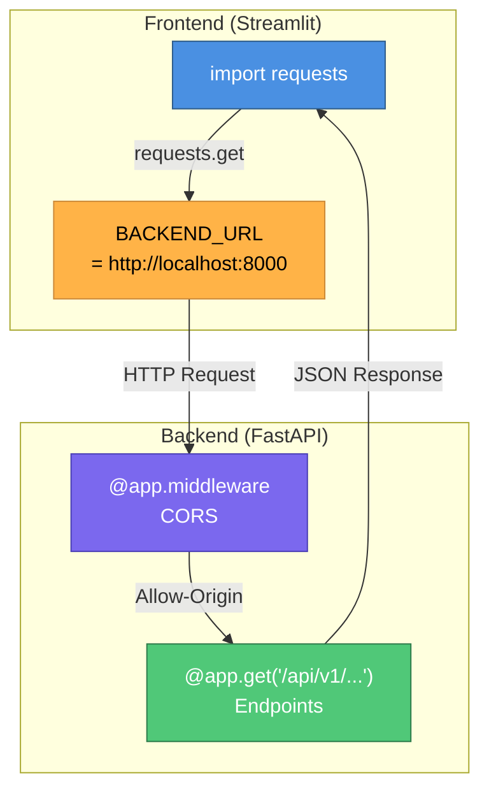

### 9.2 Integração Externa (REST Countries)

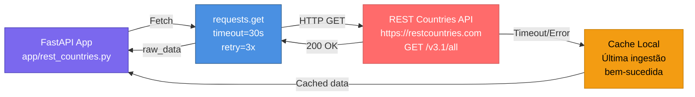

---

## 10. PADRÕES DE CÓDIGO E DESIGN

### 10.1 Estrutura de Módulos

```
app/
├── main.py                    # FastAPI app instance + routes
├── __init__.py
├── api/
│   ├── __init__.py
│   ├── rest_countries.py      # HTTP client + normalizer
│   └── schemas.py             # Pydantic models (v0.2)
├── database/
│   ├── __init__.py
│   ├── connection.py          # DB session + engine
│   ├── models.py              # SQLAlchemy models
│   └── crud.py                # Database operations (v0.2)
├── utils/
│   ├── __init__.py
│   ├── helpers.py             # Utility functions
│   ├── logger.py              # Logging config
│   └── constants.py           # Constants
├── scripts/
│   ├── __init__.py
│   └── ingest.py              # CLI for manual ingest
└── streamlit/
    ├── app.py                 # Main Streamlit app
    └── components/            # Reusable components (v0.2)

tests/
├── __init__.py
├── conftest.py                # Pytest fixtures
├── unit/
│   ├── test_api.py
│   ├── test_models.py
│   └── test_database.py
└── integration/
    └── test_ingest_e2e.py

documentacoes/
├── PRD_PG_genIA_MVP-01.md
├── BACKLOG_PG_genIA_MVP-01.md
├── ARCHITECTURE.md            # (este arquivo)
├── API.md
└── CHANGELOG.md
```

### 10.2 Padrões Design (OOP)

```python
# ✅ BOAS PRÁTICAS

# 1. Type Hints + Docstrings
def fetch_countries(timeout: int = 30) -> List[dict]:
    """Fetch all countries from REST Countries API.
    
    Args:
        timeout: Request timeout in seconds (default: 30)
        
    Returns:
        List of country dictionaries from API
        
    Raises:
        httpx.TimeoutException: If request exceeds timeout
        httpx.HTTPStatusError: If API returns error status
    """

# 2. Error Handling + Logging
try:
    response = httpx.get(url, timeout=timeout)
    response.raise_for_status()
    logger.info(f"Fetched {len(response.json())} countries")
    return response.json()
except httpx.HTTPError as e:
    logger.error(f"API fetch failed: {e}")
    raise

# 3. Pydantic Validation
class CountrySchema(BaseModel):
    name_common: str
    name_official: str
    iso_code_2: str
    region: str
    population: int
    
    model_config = ConfigDict(str_strip_whitespace=True)

# 4. SQLAlchemy with Type Hints
class Country(Base):
    __tablename__ = "countries"
    
    id: Mapped[int] = mapped_column(primary_key=True)
    name_common: Mapped[str] = mapped_column(String(255), unique=True)
    population: Mapped[int] = mapped_column(BigInteger)
    languages: Mapped[List["Language"]] = relationship(back_populates="country")
```

### 10.3 Padrão: Dependency Injection (FastAPI)

```python
# Database session dependency
def get_db_session() -> Generator[Session, None, None]:
    session = SessionLocal()
    try:
        yield session
    finally:
        session.close()

# Use em rotas
@app.get("/countries")
def get_countries(
    session: Session = Depends(get_db_session),
    region: Optional[str] = None
) -> List[CountrySchema]:
    query = session.query(Country)
    if region:
        query = query.filter(Country.region == region)
    return query.all()
```

---

## 11. PERFORMANCE & OTIMIZAÇÕES

### 11.1 Database Optimization

```sql
-- Índices críticos
CREATE INDEX idx_iso_code_2 ON countries(iso_code_2);
CREATE INDEX idx_iso_code_3 ON countries(iso_code_3);
CREATE INDEX idx_region ON countries(region);
CREATE INDEX idx_subregion ON countries(subregion);

-- Análise esperada
-- SELECT * FROM countries WHERE region='Europe' → ~2ms (com índice)
-- vs ~50ms (sem índice)

-- Query Planning
EXPLAIN QUERY PLAN
SELECT * FROM countries WHERE region = 'Europe';
```

### 11.2 Caching Strategy (v0.2)

```
Level 1: Application Cache (Memory)
    |── Duração: 1 hora
    |── Tamanho: ~10MB
    |── Tecnologia: Python dict + TTL

Level 2: Redis Cache (v0.2)
    |── Duração: 3-6 horas
    |── Tamanho: 50MB
    |── Tecnologia: Redis

Level 3: Database
    |── Persistência durável
    |── Queries com índices
    |── Atualização 1x/dia (scheduler)

Cache Hit Rate Target: > 80%
```

### 11.3 Load Testing (v0.2)

```
Ferramentas: k6 / Apache Bench / Locust

Cenários:
1. Health Check
   - 100 req/s por 1 minuto
   - Target P95: < 10ms

2. Country List Query
   - 50 req/s por 5 minutos
   - Target P95: < 500ms
   - Memory: stable, sem leak

3. Concurrent Users
   - 100 usuarios simultâneos
   - Simular filtro + scroll tabela
   - Target: 0 errors
```

---

## 12. CHECKLIST DE VALIDAÇÃO ARQUITETURAL

```
✅ Separação de Responsabilidades
    [✓] Frontend (Streamlit)
    [✓] Backend (FastAPI)
    [✓] Database (SQLAlchemy + SQLite)
    [✓] Scheduler (APScheduler)

✅ Escalabilidade
    [✓] Stateless backend (fácil horizontal scaling)
    [✓] Database migration path (PostgreSQL ready)
    [✓] Cache layer designed (implementar v0.2)
    [✓] Containerizado (Docker ready)

✅ Confiabilidade
    [✓] Retry logic (HTTP client, 3x max)
    [✓] Fallback (local cache em caso de API down)
    [✓] Logging estruturado (rastreabilidade)
    [✓] Health checks (/health endpoint)

✅ Segurança
    [✓] Input validation (Pydantic)
    [✓] CORS configurado
    [✓] Variáveis de ambiente (.env)
    [✓] Sem hardcoded secrets

✅ Manutenibilidade
    [✓] Type hints (100%)
    [✓] Docstrings (Google style)
    [✓] Testes (unit + integration, 80%+)
    [✓] CI/CD (GitHub Actions)
    [✓] Documentação (README + ARCHITECTURE)

✅ Performance
    [✓] Database indexes
    [✓] Connection pooling
    [✓] Async where possible
    [✓] Cache design (v0.2)

```

---

## 13. ROADMAP TÉCNICO

### Release 0.1 (Set 2026) - Core
- ✅ FastAPI + Streamlit integrados
- ✅ SQLite com relacionamentos
- ✅ Scheduler de sincronização
- ✅ 80%+ test coverage

### Release 0.2 (Out 2026) - APIs & Scale
- 🔄 Endpoints REST completos
- 🔄 Cache layer (Redis)
- 🔄 Rate limiting
- 🔄 Advanced visualizations

### Release 0.3 (Nov 2026) - Auth & Intelligence
- 🔄 JWT authentication
- 🔄 Time-series data
- 🔄 Claude API integration
- 🔄 Migration to PostgreSQL (optional)

---

## 14. DOCUMENTOS RELACIONADOS

- **PRD:** `documentacoes/PRD_PG_genIA_MVP-01.md`
- **BACKLOG:** `documentacoes/BACKLOG_PG_genIA_MVP-01.md`
- **API Spec:** `documentacoes/API.md` (a criar)
- **CHANGELOG:** `documentacoes/CHANGELOG.md` (a criar)

---

**Documento versão 1.0 | Última atualização: 15/09/2026**  
**Arquiteto de Software:** [Nome]  
**Revisor Técnico:** [Nome]  
**Aprovação:** ⏳ Pendente
